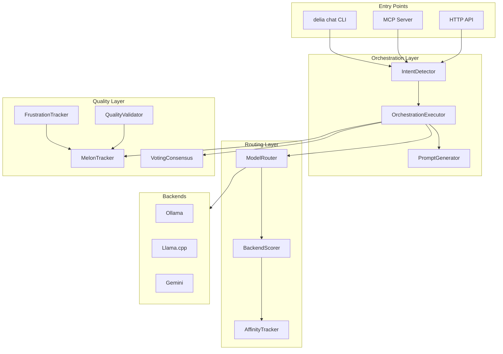
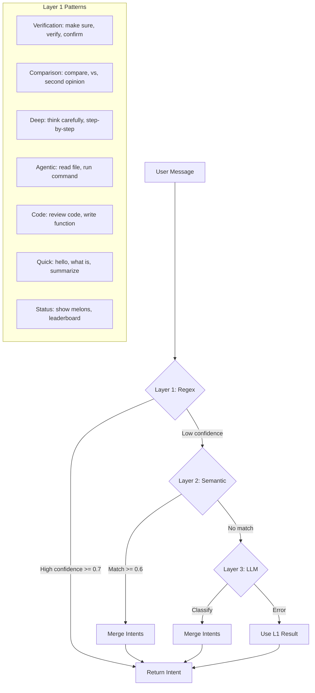
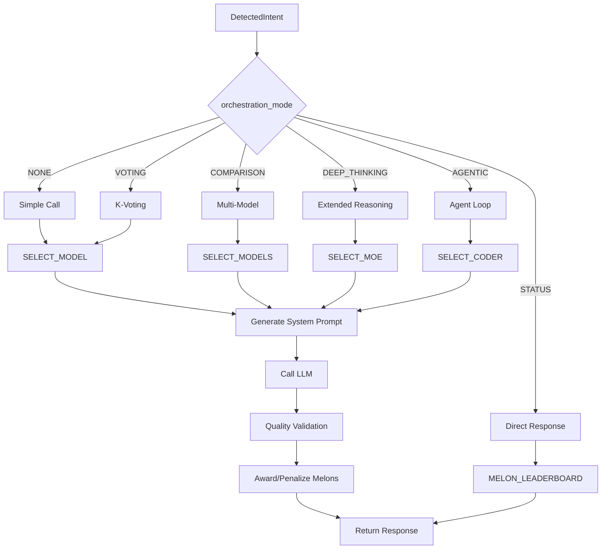
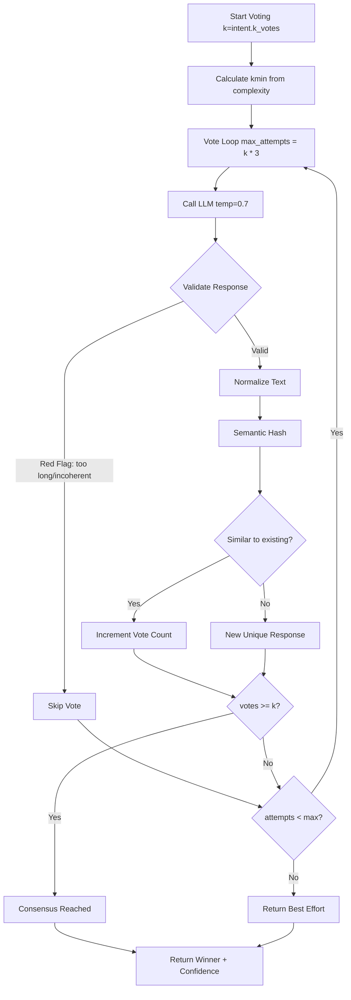
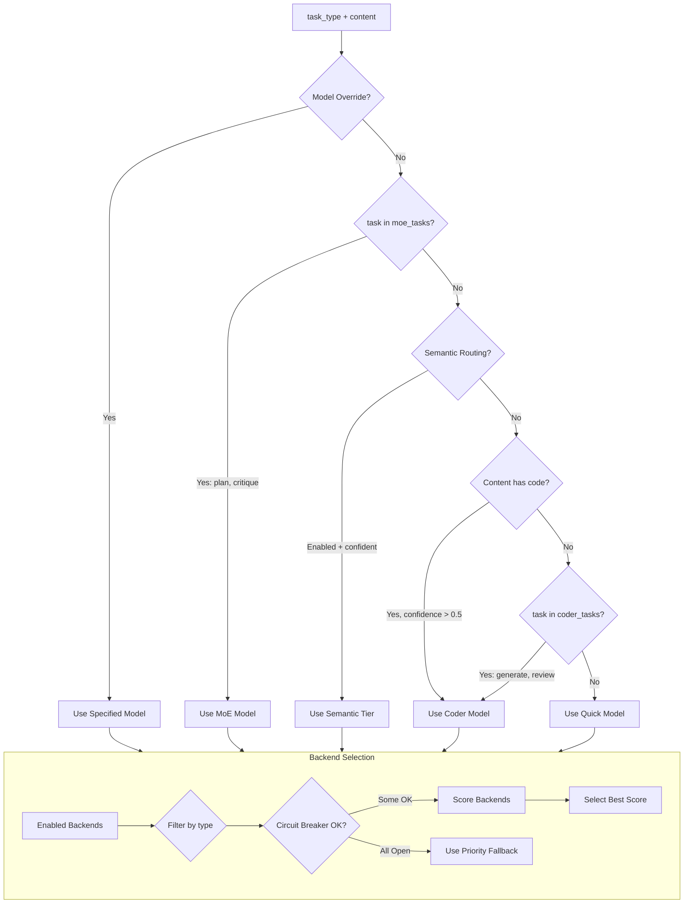
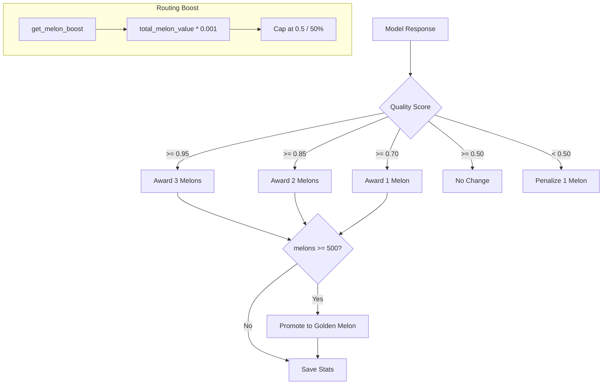
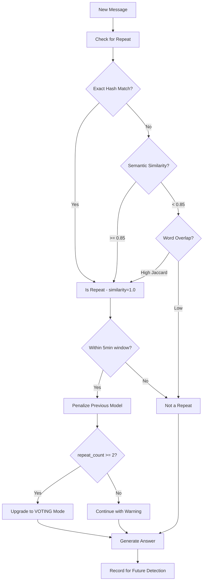
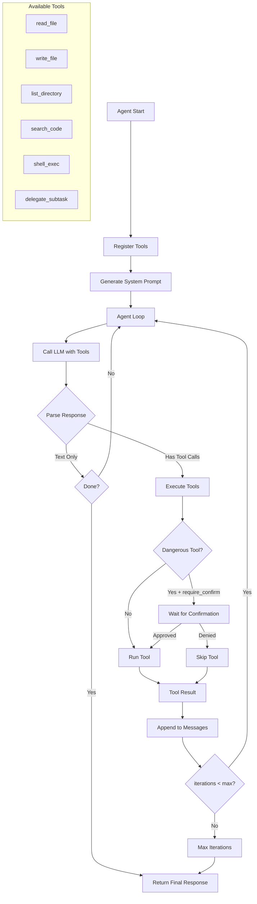

# Delia Routing and Decision Logic Map

A comprehensive visual documentation of Delia's entire orchestration system.

## Table of Contents

1. [High-Level Architecture](#1-high-level-architecture)
2. [Intent Detection (3-Tier NLP)](#2-intent-detection-3-tier-nlp)
3. [Orchestration Mode Execution](#3-orchestration-mode-execution)
4. [K-Voting Consensus Flow](#4-k-voting-consensus-flow)
5. [Model/Backend Selection](#5-modelbackend-selection)
6. [Melon Reward System](#6-melon-reward-system)
7. [Frustration Detection](#7-frustration-detection)
8. [Agent Loop (Agentic Mode)](#8-agent-loop-agentic-mode)
9. [Tool Reference](#9-tool-reference)
10. [Expected Outcomes by Mode](#10-expected-outcomes-by-mode)

---

## 1. High-Level Architecture



### Key Components

| Component | File | Purpose |
|-----------|------|---------|
| IntentDetector | `orchestration/intent.py` | 3-tier NLP intent detection |
| OrchestrationExecutor | `orchestration/executor.py` | Execute orchestration modes |
| PromptGenerator | `prompts.py` | Generate role-specific system prompts |
| ModelRouter | `routing.py` | Select optimal model for task |
| BackendScorer | `routing.py` | Score backends by performance |
| AffinityTracker | `config.py` | Track backend-task affinity |
| MelonTracker | `melons.py` | Reward system for model quality |
| FrustrationTracker | `frustration.py` | Detect repeated questions |
| VotingConsensus | `voting.py` | K-voting consensus mechanism |
| QualityValidator | `quality.py` | Validate response quality |

---

## 2. Intent Detection (3-Tier NLP)



### Pattern Priority Order

| Priority | Category | Example Triggers | Result |
|----------|----------|------------------|--------|
| 1 | AGENTIC | read file, run command, execute | OrchestrationMode.AGENTIC |
| 2 | STATUS | show melons, leaderboard | OrchestrationMode.NONE + task="status" |
| 3 | VERIFICATION | make sure, verify, confirm | OrchestrationMode.VOTING |
| 4 | COMPARISON | compare, vs, second opinion | OrchestrationMode.COMPARISON |
| 5 | DEEP_THINKING | think carefully, step-by-step | OrchestrationMode.DEEP_THINKING |
| 6 | CODE | review code, write function | task_type="coder" |
| 7 | QUICK | hello, what is, summarize | task_type="quick" |

### Layer Details

| Layer | Technology | Speed | Use Case |
|-------|------------|-------|----------|
| 1 (Regex) | Pre-compiled regex patterns | ~0ms | Explicit triggers, known patterns |
| 2 (Semantic) | sentence-transformers embeddings | ~50-100ms | Paraphrased requests |
| 3 (LLM) | Quick model classification | ~500ms | Complex/ambiguous cases |

---

## 3. Orchestration Mode Execution



### Orchestration Modes

| Mode | Handler | Description |
|------|---------|-------------|
| NONE | `_execute_simple()` | Single model call with role-specific prompt |
| VOTING | `_execute_voting()` | K-voting consensus for reliability |
| COMPARISON | `_execute_comparison()` | Side-by-side multi-model output |
| DEEP_THINKING | `_execute_deep_thinking()` | Extended reasoning with MoE/thinking model |
| AGENTIC | `_execute_agentic()` | Full agent loop with tools |
| STATUS | `_execute_status_query()` | Direct system response (no LLM) |

---

## 4. K-Voting Consensus Flow



### K-Voting Mathematics (Wolfram Alpha Verified ✓)

Based on the MDAP paper "Smashing Intelligence into a Million Pieces":

**Core Formula:**
```
P(correct) = 1 / (1 + ((1-p)/p)^k)
```

**Verified Accuracy Values:**
| Base Accuracy (p) | k=2 | k=3 | k=4 | k=5 |
|-------------------|-----|-----|-----|-----|
| 0.95 | 99.72% | 99.99% | 99.999% | ~100% |
| 0.99 | 99.99% | 99.9999% | ~100% | ~100% |

**Minimum k Calculation:**
```
kmin = Θ(ln s)
```
Where `s` = estimated task steps (from prompt complexity analysis)

**Practical Recommendation:** k=3 is optimal for most use cases (99.99%+ accuracy)

### Red Flag Criteria

Responses are excluded from voting if they:
- Exceed max_response_length (default: 700 tokens)
- Fail quality validation (incoherent, repetitive)
- Contain obvious errors

---

## 5. Model/Backend Selection



### Model Tiers

| Tier | Use Case | Example Models |
|------|----------|----------------|
| quick | Fast responses, simple questions | olmo-3:7b-instruct, qwen2.5:7b |
| coder | Code generation, review, debugging | qwen2.5-coder:14b, devstral-small-2 |
| moe | Complex reasoning, planning | mixtral:8x7b, nemotron-3-nano |
| thinking | Extended chain-of-thought | olmo-3:7b-think |

### Backend Scoring Weights

| Factor | Weight | Description |
|--------|--------|-------------|
| Latency | 0.35 | Lower P50 latency = higher score |
| Reliability | 0.35 | Higher success rate = higher score |
| Throughput | 0.15 | Higher tokens/sec = higher score |
| Availability | 0.15 | Circuit breaker state |
| Cost | 0.00 | Disabled by default |

### Score Formula

```python
total = (
    weights.latency * latency_score +
    weights.throughput * throughput_score +
    weights.reliability * reliability_score +
    weights.availability * availability_score +
    weights.cost * cost_score
)

# Apply affinity boost for task type
total = affinity_tracker.boost_score(total, backend_id, task_type)

# Apply melon boost for model performance
total += melon_tracker.get_melon_boost(model_id, task_type)
```

---

## 6. Melon Reward System



### Melon Economy

| Event | Melons | Description |
|-------|--------|-------------|
| Excellent response (>= 0.95) | +3 | Outstanding quality |
| Great response (>= 0.85) | +2 | Above average |
| Good response (>= 0.70) | +1 | Acceptable |
| Mediocre response (>= 0.50) | 0 | No change |
| Poor response (< 0.50) | -1 | Penalty |
| Voting consensus bonus | +1 | Extra for reliability |
| Frustration repeat | -2 to -5 | Scaled by repeat count |

### Golden Melons

- **Threshold:** 500 melons = 1 golden melon 🏆
- **Expected responses to earn:** ~357 (with avg quality)
- **Routing boost formula:** `min(total_melon_value * 0.001, 0.5)`
- **Maximum boost:** 50% (reached at 500 total value = 1 golden)
- **Persistence:** Saved to `~/.delia/melons.json`

### Mathematics (Wolfram Alpha Verified)

**Expected melon gain per response:** μ = 1.4 melons  
**Variance:** σ² = 1.14  
**Standard deviation:** σ ≈ 1.07 melons

| Quality Distribution | Probability | Melons |
|---------------------|-------------|--------|
| Excellent (≥0.95) | 15% | +3 |
| Great (≥0.85) | 35% | +2 |
| Good (≥0.70) | 30% | +1 |
| Meh (≥0.50) | 15% | 0 |
| Poor (<0.50) | 5% | -1 |

**Time to Golden Melon:**
- Heavy user (~50 queries/day): ~1 week
- Regular user (~20 queries/day): ~2.5 weeks
- Light user (~10 queries/day): ~5 weeks

---

## 7. Frustration Detection



### Detection Methods

| Method | Threshold | Speed |
|--------|-----------|-------|
| Exact hash match | 1.0 | Instant |
| Semantic similarity | >= 0.85 | ~50ms |
| Word overlap (Jaccard) | >= 0.7 | ~1ms |

### Penalty Calculation

```python
penalty = 2 + repeat_count  # Base 2, scales with frustration
```

| Repeat Count | Penalty | Action |
|--------------|---------|--------|
| 1 | -3 melons | Warning logged |
| 2+ | -4+ melons | Auto-upgrade to VOTING |

---

## 8. Agent Loop (Agentic Mode)



### Agent Configuration

| Setting | Default | Description |
|---------|---------|-------------|
| max_iterations | 10 | Maximum tool call iterations |
| timeout_per_tool | 60s | Per-tool execution timeout |
| total_timeout | 300s | Total agent timeout |
| parallel_tools | false | Execute tools in parallel |
| native_tool_calling | auto | Use OpenAI-format tools API |
| allow_write | false | Enable file write operations |
| allow_exec | false | Enable shell execution |
| require_confirmation | true | Confirm dangerous operations |

---

## 9. Tool Reference

### MCP Tools (External Orchestration)

| Tool | Description | Parameters |
|------|-------------|------------|
| `delegate` | Route task to optimal model | task, content, model, language |
| `think` | Deep reasoning with thinking model | problem, context, depth |
| `batch` | Parallel tasks across backends | tasks (JSON array) |
| `vote` | K-voting for reliability | prompt, k, model |
| `compare` | Multi-model comparison | prompt, models |
| `chain` | Sequential task pipeline | steps (JSON array) |
| `workflow` | DAG workflow with conditionals | definition (JSON) |
| `agent` | Full agent with tools | prompt, tools, max_iterations |
| `melons` | Show melon leaderboard | task_type (optional) |

### Agent Tools (Internal Execution)

| Tool | Description | Dangerous |
|------|-------------|-----------|
| `read_file` | Read file contents | No |
| `write_file` | Write/create files | Yes |
| `list_directory` | List directory contents | No |
| `search_code` | Regex search in codebase | No |
| `shell_exec` | Execute shell commands | Yes |
| `delegate_subtask` | Spawn sub-agent for task | No |

### Tool Permission Levels

| Level | Description | Example Tools |
|-------|-------------|---------------|
| read | Read-only operations | read_file, list_directory, search_code |
| write | Modify files | write_file, delete_file |
| exec | Execute commands | shell_exec |

---

## 10. Expected Outcomes by Mode

| Mode | Input Signal | Model Selection | Outcome |
|------|--------------|-----------------|---------|
| NONE | General chat | Based on task_type | Single model response |
| VOTING | "make sure", "verify" | Same model, k times | K-consensus (up to 99.9999% accuracy) |
| COMPARISON | "compare", "vs" | Multiple models | Side-by-side outputs |
| DEEP_THINKING | "think carefully" | MoE/thinking tier | Extended reasoning |
| AGENTIC | "read file", "run" | Coder tier | Agent loop with tools |
| STATUS | "show melons" | None (direct) | System response |

### Quality Guarantees

| Mode | Accuracy | Latency | Cost |
|------|----------|---------|------|
| NONE | ~95% (model dependent) | Low | 1 call |
| VOTING (k=3) | ~99.99% | Medium | 3-9 calls |
| VOTING (k=5) | ~99.9999% | High | 5-15 calls |
| COMPARISON | N/A (multiple views) | Medium | N calls |
| DEEP_THINKING | ~97% (reasoning) | High | 1 call |
| AGENTIC | Variable | Variable | 1-10 calls |

---

## Quick Reference Card

```
┌─────────────────────────────────────────────────────────────┐
│                    DELIA ROUTING QUICK REF                  │
├─────────────────────────────────────────────────────────────┤
│ INTENT DETECTION (3 Tiers)                                  │
│   L1: Regex (0ms) → L2: Semantic (50ms) → L3: LLM (500ms)  │
├─────────────────────────────────────────────────────────────┤
│ ORCHESTRATION MODES                                         │
│   NONE → Single call    VOTING → K-consensus               │
│   COMPARISON → Multi    DEEP → Extended reasoning          │
│   AGENTIC → Tools       STATUS → Direct response           │
├─────────────────────────────────────────────────────────────┤
│ MODEL TIERS                                                 │
│   quick → Fast/simple   coder → Code tasks                 │
│   moe → Complex         thinking → Chain-of-thought        │
├─────────────────────────────────────────────────────────────┤
│ K-VOTING FORMULA (Wolfram Verified)                         │
│   P(correct) = 1 / (1 + ((1-p)/p)^k)                       │
│   p=0.95, k=3 → 99.99%   p=0.99, k=3 → 99.9999%           │
├─────────────────────────────────────────────────────────────┤
│ MELON REWARDS (Wolfram Verified)                            │
│   >0.95 → +3    >0.85 → +2    >0.70 → +1    <0.50 → -1    │
│   500 melons = 1 golden melon 🏆 (~357 responses)          │
│   Boost = min(total_value * 0.001, 0.5) → max 50%          │
├─────────────────────────────────────────────────────────────┤
│ BACKEND SCORING (weights sum to 1.0)                        │
│   Latency: 0.35   Reliability: 0.35                        │
│   Throughput: 0.15   Availability: 0.15                    │
│   Latency score = 1 / (1 + ms/1000)                        │
├─────────────────────────────────────────────────────────────┤
│ FRUSTRATION DETECTION                                       │
│   Similarity >= 0.85 within 5min → Penalize + maybe VOTE   │
└─────────────────────────────────────────────────────────────┘
```

---

## File References

| Component | File Path |
|-----------|-----------|
| Intent Detection | `src/delia/orchestration/intent.py` |
| Orchestration Executor | `src/delia/orchestration/executor.py` |
| Prompt Generator | `src/delia/prompts.py` |
| Model Router | `src/delia/routing.py` |
| Backend Scorer | `src/delia/routing.py` |
| Affinity Tracker | `src/delia/config.py` |
| Melon Tracker | `src/delia/melons.py` |
| Frustration Tracker | `src/delia/frustration.py` |
| Voting Consensus | `src/delia/voting.py` |
| Quality Validator | `src/delia/quality.py` |
| Agent Loop | `src/delia/tools/agent.py` |
| Tool Registry | `src/delia/tools/registry.py` |
| MCP Server | `src/delia/mcp_server.py` |
| HTTP API | `src/delia/api.py` |

